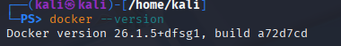

Valentin Hernandez 
# Creación de ambiente de pruebas para aplicaciones inseguras

El objetivo de este práctico es armar un ambiente de puebas utilizando una máquina virtual con Kali Linux, un proxy de interceptación (Burp Suite), Docker y la aplicación vulnerable que en este caso fue OWASP Juice shop

## PASO 1:Como primer paso es la instalación de kali en VirtualBox

###  1. Descargar la imagen de kali linux en el sitio oficial de kali linux (https://www.kali.org/get-kali/)
### 2. Crear una máquina virtual en Virtualbox por defecto.
### 3. Iniciar la máquina, ingresar con el usuario y contraseña por defecto que es (kali, kali)
.
### 4. Actualizar los paquetes con los siguientes comandos: sudo apt update && sudo apt upgrade -y.

## Paso 2: Instalación de Burp Suite

### 1. burp suite ya viene instalado por defecto lo cual verifica si ya estaba instalado.
### 2. Desde la terminal ejecutar "burpsuite" lo que hace   que se abre el programa .
### 3. Clickiar en Temporary project in memory luego en Usar Burp defaults y por ultimo  Start Bur.
### 4. Aparecio un aviso sobre la version de java la cual no afecta en nada el funcionamiento.

## Paso 3: Instalación de Docker

### 1. instalar con los siguientes comandos el repositorio oficial y dependencias 
sudo apt install -y apt-transport-https ca-certificates curl software-properties-common
curl -fsSL https://download.docker.com/linux/debian/gpg | sudo apt-key add -
echo "deb [arch=amd64] https://download.docker.com/linux/debian bullseye stable" | sudo tee /etc/apt/sources.list.d/docker.list.
### 2. Instalar docker con los comandos 
sudo apt update
sudo apt install -y docker-ce.
### 3. Como tercer paso verificar la instalacion con el comando docker --version
.

## Paso 4: Ejecución de OWASP Juice Shop 

### 1. Descargar y ejecutar la aplicación con el el comando desde la terminal 
sudo docker run --rm -p 3000:3000 bkimminich/juice-shop
.
### 2. Levantar el contenedor y ingresar desde el navegador en kali con http://localhost:3000.
### 3. La aplicación cargo correctamente .

## Paso 5: Prueba de tráfico en Burp Suite 

### 1. Configurar Firefox para que todo el tráfico pase por el proxy, abrir Firefox y entrar a la configuración en la barra de dirección about:preferences.
### 2. En la sección Network Settings, seleccionar  la opción Manual proxy configuration. 
### 3. Agregar los valores:
HTTP Proxy: 127.0.0.1
Port: 8080
### 4. Marcar la opción "also use this proxy for HTTPS" lo que asegura que no solo el trafico HTTP sino tambien HTTPS, FTP y otros protocolos pasen por Burp.

### 5. Guardar los cambios y cerrar la configuracion. 
### 6. Con Burp Suite en ejecucion, ingresar a Proxy, Intercept y verificar que la opción Intercept is ON estuviera activa.  
Esta función permite detener todas las solicitudes antes de que lleguen al servidor, para poder revisarlas, modificarlas o incluso descartarlas..
### 7.  Burp Suite mostró la primera peticion interceptada.  
Se trato de una solicitud HTTP GET.todas las peticiones procesadas quedan registradas en la pestaña HTTP history

Con esto quedo configurado el ambiente de pruebas en una maquina virtual con Kali Linux.  
Se comprobo el funcionamiento de Burp Suite como proxy de interceptacion, la instalación de Docker y la ejecucion de la aplicacion OWASP Juice Shop.  
Tambien, se verifico la interceptacion y analisis del trafico entre el navegador y la aplicacion, cumpliendo con todos los objetivos planteados en la consigna.

