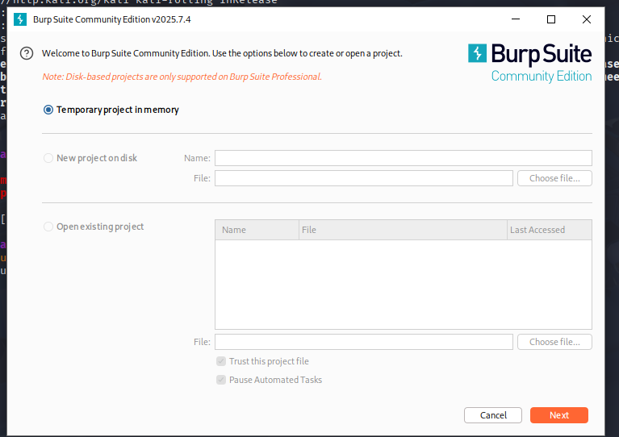

Valentin Hernandez 
Creacion de ambiente de pruebas para aplicaciones inseguras

El objetivo de este practico es armar un ambiente de puebas utilizando una máquina virtual con Kali Linux, un proxy de interceptación (Burp Suite), Docker y la aplicación vulnerable que en este caso fue OWASP Juice shop

PASO 1:instalacion fue la instalacion de kali en VirtualBox

1. Descargue ña imagen de kali linux en el sitio oficial de kali linux (https://www.kali.org/get-kali/)
2. Cree una maquina virtual en Virtualbox por defecto.
3. Inicie la maquina, ingrese con el usuario y contraseña por defecto que es (kali, kali)
.
4. Actualice los paquetes con los siguientes comandos: sudo apt update && sudo apt upgrade -y.

Paso 2: Instalacion de Burp Suite

1. burp suite ya viene instalado por defecto lo cual verifique si ya estaba instalado.
2. Desde la terminal ejecute burpsuite lo que hace que se abre el programa .
3. Clickie en Temporary project in memory luego en Use Burp defaults y por ultimo  Start Bur.
4. Aparecio un aviso sobre la version de java la cual no afecta en nada el funcionamiento.

Paso 3: Instalacion de Docker

1. instale con los siguientes comandos el repositorio oficial y dependencias 
sudo apt install -y apt-transport-https ca-certificates curl software-properties-common
curl -fsSL https://download.docker.com/linux/debian/gpg | sudo apt-key add -
echo "deb [arch=amd64] https://download.docker.com/linux/debian bullseye stable" | sudo tee /etc/apt/sources.list.d/docker.list.
2. Instale docker con los comandos 
sudo apt update
sudo apt install -y docker-ce.
3. Como tercer paso verifique la instalacion con el comando docker --version
.

Paso 4: Ejecucion de OWASP Juice Shop 

1. Descargue y ejecute la aplicacion con el el comando desde la terminal 
sudo docker run --rm -p 3000:3000 bkimminich/juice-shop
.
2. Levante el contenedor y ingrese desde el navegador en kali con http://localhost:3000.
3. La aplicacion cargo de buena manera .

Paso 5: Prueba de trafico en Burp Suite 

1. Configure Firefox para que todo el trafico pase por el proxy, abri Firefox y entre a la configuracion en la barra de direccion about:preferences.
2. En la seccion Network Settings, seleccione  la opcion Manual proxy configuration. 
3. Agregue los valores:
HTTP Proxy: 127.0.0.1
Port: 8080
4. Marque la opcion "also use this proxy for HTTPS" o que asegura que no solo el trafico HTTP sino tambien HTTPS, FTP y otros protocolos pasen por Burp.

5. Guarde los cambios y cerre la configuracion. 
6. Con Burp Suite en ejecucion, ingrese a Proxy, Intercept y verifiqué que la opción Intercept is ON estuviera activa.  
Esta función permite detener todas las solicitudes antes de que lleguen al servidor, para poder revisarlas, modificarlas o incluso descartarlas..
7.  Burp Suite mostró la primera peticion interceptada.  
Se trato de una solicitud HTTP GET.todas las peticiones procesadas quedan registradas en la pestaña HTTP history

Con esto quedo configurado el ambiente de pruebas en una maquina virtual con Kali Linux.  
Se comprobo el funcionamiento de Burp Suite como proxy de interceptacion, la instalación de Docker y la ejecucion de la aplicacion OWASP Juice Shop.  
Tambien, se verifico la interceptacion y analisis del trafico entre el navegador y la aplicacion, cumpliendo con todos los objetivos planteados en la consigna.

